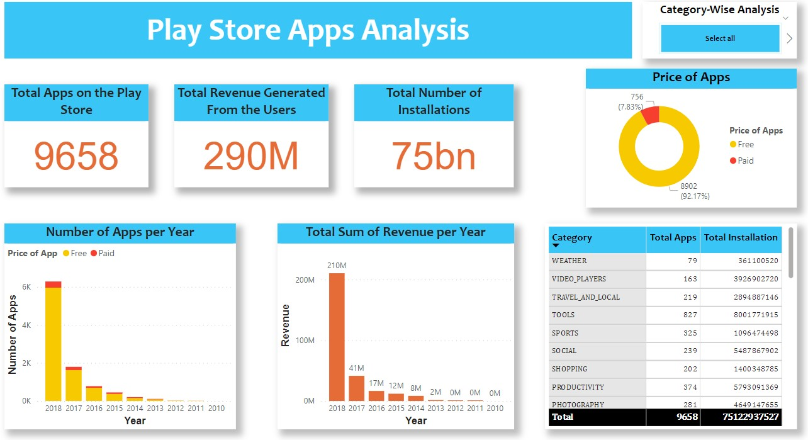
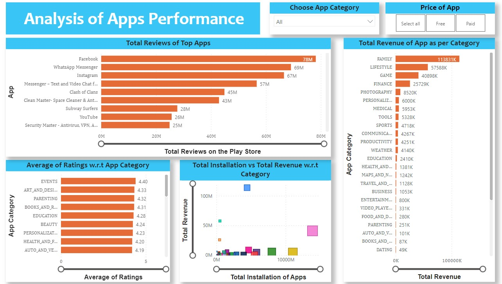
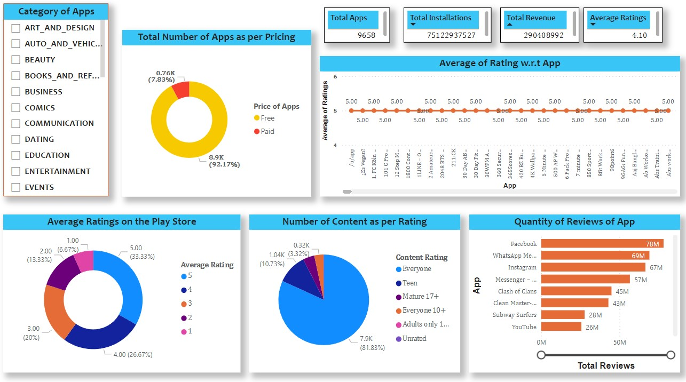

# **Project Introduction**

In this project I have created a dashboard in Power BI about the performance of apps listed on the Play Store.

The dashboard has 3 sheets.

# **My Analysis and the Dashboard**

The objective was to present a visualization on the key metrics about the apps (total downloads, top reviews counts, revenues generated by the apps, etc) that are listed on the play store.

The final visualizations in the dashboard will look like this.

_Summary of the apps listed on the Play Store_

_Analysis of the performance of Apps_

_Analysis as per category of apps_

Note:

    The dashboard is made in Microsoft Power BI.
